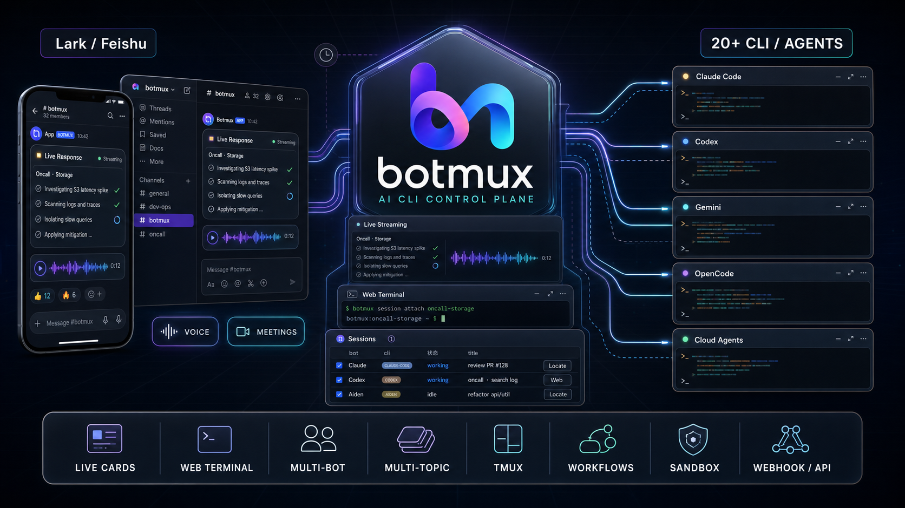

# botmux

<p align="center">
  
</p>

<p align="center">
  <a href="https://www.npmjs.com/package/botmux"></a>
  = 22">
  <a href="LICENSE"></a>
  <a href="https://github.com/ycf-gbk/deepcoldy-botmux-ycf"></a>
</p>

<p align="center"><b>Drive your AI coding CLI from Lark (Feishu).</b> One message starts a session, each session runs its own isolated CLI process, streamed back in real time — synced across phone, desktop, and terminal.</p>

<p align="center">
  <a href="https://deepcoldy.github.io/botmux/en/"><b>📖 Docs</b></a> ·
  <a href="#5-minute-setup"><b>🚀 Quickstart</b></a> ·
  <b>✨ Showcase</b> ·
  <a href="README.md">中文</a>
</p>

<p align="center">
  
</p>

---

A daemon watches Lark messages and spawns an isolated session process for each new session, streaming the AI coding CLI / agent's output back as live Lark cards and offering an interactive web terminal. It **doesn't reimplement agent capabilities** — it bridges the tools you already use directly (**20+ CLI / agent adapters**, see [Supported CLIs & Agents](#supported-clis--agents)).

## What it solves

- **The agent can't reach you, and you can't drive it from your phone** — the CLI runs on a dev box, you're on your phone. botmux pushes every turn as a Lark card so you can view / follow up / interrupt anywhere, and open a writable web terminal to operate it directly.
- **The CLI is blind to your Lark context** — pull a bot into a topic group / on-call group and one @ runs it right in your local repo; a session can be moved to another group with `/relay`, keeping its full context.
- **A single agent isn't enough** — put several bots backed by different CLIs in one group, @ whoever should act, and have Claude Code and Codex review the same MR — each analyzing independently and pushing back when they disagree.

## 5-Minute Setup

> About 5 minutes: a single Lark QR scan in `botmux setup` creates the app, configures all permissions, and publishes a version in one flow (add `--no-open-platform-auto` to only create the app and skip the permission + publish automation, which you then complete manually; creating the app manually / pasting credentials is a separate option inside setup).

```bash
npm install -g botmux        # requires Node >= 22
botmux setup                 # one scan to create the app → pick a CLI → pick a working dir (permissions + publish auto-configured)
botmux start                 # start the daemon (botmux autostart enable for auto-start on boot)
```

Then DM the bot, or run `botmux dashboard` to create a group, and start chatting. Full steps (Lark international, manual permission / publish setup after `--no-open-platform-auto`, troubleshooting) are in the **[5-Minute Quickstart](https://deepcoldy.github.io/botmux/en/quickstart)**.

## Core Scenarios

- **[Live streaming cards](https://deepcoldy.github.io/botmux/en/cards)** — one live-updating card per turn, relaying the terminal screen verbatim as a screenshot; one tap to show/hide output, scroll, or restart/close/adopt the session.
- **[Multi-bot collaboration](https://deepcoldy.github.io/botmux/en/multi-bot)** — multi-bot @mention routing in one group; different CLIs mean different models and natural diversity — have them critique each other on design reviews, code reviews, tech-stack choices.
- **[Multi-topic orchestration](https://deepcoldy.github.io/botmux/en/multi-topic)** — hand an orchestrator a big task and it seeds topics in the group, spins up an isolated session per bot to run a pipeline, and the Lark task board shows every subtask's progress at a glance.
- **[Interactive web terminal](https://deepcoldy.github.io/botmux/en/web-terminal)** — not just viewing output: drive the CLI directly from a browser / phone, with a floating shortcut bar on mobile (Esc, Ctrl+C, arrow keys).
- **[Adopt & relay sessions](https://deepcoldy.github.io/botmux/en/adopt)** — running halfway in local tmux, `/adopt` it from your phone; `/relay` moves the whole session (same process, same memory) into a team group to continue.
- **[Scheduled tasks](https://deepcoldy.github.io/botmux/en/schedule) & [external triggers](https://deepcoldy.github.io/botmux/en/webhook)** — configure recurring tasks in natural language (alert analysis / group summaries); trigger programmatically from external systems via [Webhook](https://deepcoldy.github.io/botmux/en/webhook) or the [task-trigger API](https://deepcoldy.github.io/botmux/en/api-task-trigger).
- **[On-call mode](https://deepcoldy.github.io/botmux/en/oncall) & [voice summary](https://deepcoldy.github.io/botmux/en/voice)** — pull it into an on-call group and any member's @ triggers a probe in the project dir; once TTS is configured, each card footer gains a 🔊 voice-summary button that makes the model "speak plainly".

More: [Roles & teams](https://deepcoldy.github.io/botmux/en/roles) · [File sandbox](https://deepcoldy.github.io/botmux/en/sandbox) · [Dashboard](https://deepcoldy.github.io/botmux/en/dashboard) · [tmux persistence](https://deepcoldy.github.io/botmux/en/tmux).

## Supported CLIs & Agents

Switch with `cliId` in `bots.json`. **20+ adapters**, spanning local CLIs (process-isolated, reachable via `tmux attach`) and API / cloud agents (e.g. Mira, riff — reached over API / remote, not a local process). Representative ones:

`claude-code` · `codex` · `gemini` · `cursor` · `opencode` · `opencode2` · `antigravity` · `copilot` · `grok` · `kimi` · `kiro-cli` · `reasonix` · `dsh` · `aiden` · `coco` (TRAE) · `hermes` · `mira` · `riff` (cloud agent) …

The current full set of `cliId`s is authoritative in [`src/adapters/cli/registry.ts`](https://github.com/deepcoldy/botmux/blob/master/src/adapters/cli/registry.ts); per-CLI config and wrapper / gateway setups are in [CLI Adapters](https://deepcoldy.github.io/botmux/en/adapters).

## Design Philosophy: Bridge the CLI Directly, No SDK Wrapper

botmux doesn't reimplement memory, context management, tool calls, or permission systems — **most native CLI capabilities don't need reimplementing, and CLI upgrades usually benefit botmux directly** (when interfaces / params / output formats / resume semantics change, an adapter may still need to catch up). You keep talking in plain language; the daemon wraps context into structured prompts behind the scenes before feeding the CLI. An Agent-SDK-based approach is the inverse: capabilities depend on what the SDK exposes and on your own integration.

The table below compares only **verifiable integration boundaries** — it does not claim what other approaches "necessarily lack":

| Integration boundary | botmux | Agent-SDK-based approach |
|------|--------|--------------------------|
| What's bridged | The full CLI process (its built-in hooks / memory / plan mode / MCP / `/` commands) | Whatever the SDK exposes |
| CLI upgrades | Mostly benefit directly; adapter catches up when interfaces / resume change | Depends on SDK version and integration |
| Memory / context | Reuses the CLI's built-in | Depends on the SDK / self-built |
| Multi-CLI / agent | 20+ adapters, switch in one line | Depends on SDK coverage |
| Multi-bot | Multi-bot @mention routing in one group | Depends on the implementation |
| Direct terminal | Local CLIs can `tmux attach` into the real process | Depends on the implementation |

## Docs · Community · Contributing

- 📖 **Full docs** (commands / config / best practices / troubleshooting): **<https://deepcoldy.github.io/botmux/en/>**
- ✨ **Showcase**: add your own public Feishu/Lark demo link here; this repository does not embed internal documents.
- ❓ **FAQ / troubleshooting**: [FAQ](https://deepcoldy.github.io/botmux/en/faq) · [Common Pitfalls](https://deepcoldy.github.io/botmux/en/pitfalls)
- 💬 **Community**: the [About & Resources](https://deepcoldy.github.io/botmux/en/about) page has QR entries to join the internal / external "Botmux" chat groups.
- 🤝 **Contributing**: issues / PRs welcome. To add an adapter, see [CLI Adapters](https://deepcoldy.github.io/botmux/en/adapters).
- 📄 **License**: [MIT](LICENSE)

<p align="center">If it's useful, drop a ⭐ Star → <a href="https://github.com/ycf-gbk/deepcoldy-botmux-ycf">deepcoldy-botmux-ycf</a></p>
